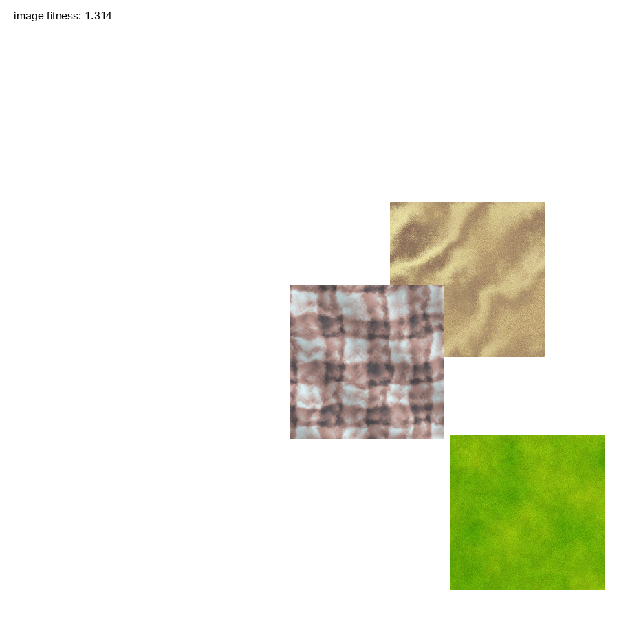

# Image Collage with Evolutionary Strategies

Make a collage of images to resemble a target image

Example of target image:




## Run:

To run with direct image comparison:

```$ python3 painter_ES.py```

To run using VGG16 features to compare images:

```$ python3 painter_ES.py --nn```


